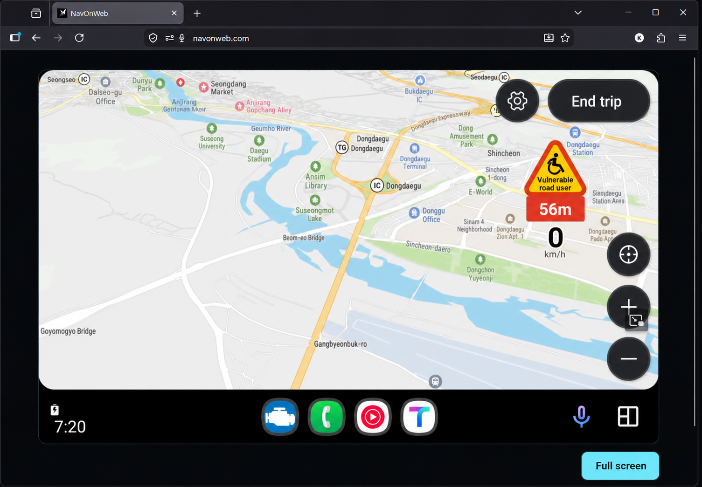
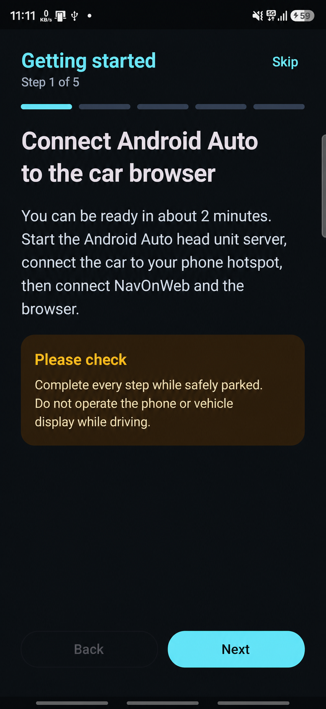
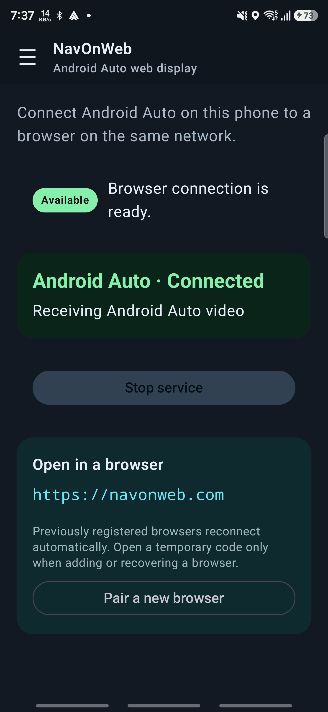

<p align="center">
  
</p>

<h1 align="center">NavOnWeb</h1>

<p align="center">
  <b>Android Auto, in your vehicle's browser.</b><br>
  휴대전화의 Android Auto 화면을 같은 네트워크의 브라우저에서 — 영상, 소리, 터치까지.
</p>

<p align="center">
  <a href="https://play.google.com/store/apps/details?id=com.eigenkodex.navonweb"></a>
</p>

<p align="center">
  <a href="#features">Features</a> ·
  <a href="#how-it-works">How it works</a> ·
  <a href="#requirements">Requirements</a> ·
  <a href="#build">Build</a> ·
  <a href="#license-and-source">License</a>
</p>

<p align="center">
  
</p>

NavOnWeb is an Android application that receives an Android Auto projection session on a phone and makes the session available to a web browser on the same local network. A paired browser can display the projected video, send touch input, and use the browser audio and microphone paths supported by the active session.

The repository contains the Android application, the browser client packaged with it, the public Cloudflare Worker/Pages implementation, build files, tests, and third-party notices.

The published binary can lag this branch. Every released binary corresponds to an immutable `v<versionName>-source` tag rather than to `main`; see [docs/SOURCE_DISTRIBUTION.md](docs/SOURCE_DISTRIBUTION.md).

## How it works

```
┌──────────────────┐    Android Auto     ┌──────────────────┐    WebRTC / LAN     ┌──────────────────┐
│  Your phone       │  ────────────────▶ │  NavOnWeb (app)  │  ────────────────▶ │  Vehicle browser │
│  (Android Auto)   │   H.264 over TLS   │  on the phone    │   video·audio·touch │  or any browser  │
└──────────────────┘                     └──────────────────┘                     └──────────────────┘
```

1. **Connect** — NavOnWeb pairs with Android Auto's Developer Head Unit Server on the same phone.
2. **Pair once** — enter the one-time 8-digit code in a browser on your local network; the browser is remembered.
3. **Drive the screen** — the browser shows the live projection with touch, key input, sound, and microphone.

<p align="center">
  
  &nbsp;&nbsp;
  
</p>

## Features

| | |
|---|---|
| 📱 **Same-phone mode** | One phone runs both Android Auto and NavOnWeb — no extra hardware |
| 🔐 **Pairing-code access** | One-time 8-digit codes; paired browsers are remembered and manageable |
| 🎥 **WebRTC video** | Automatic codec selection (H.264/VP8/VP9/AV1) with a JPEG fallback |
| 👆 **Touch & keys** | Pointer and key input forwarded to Android Auto, viewport-aware |
| 🖥️ **Projection profiles** | Basic, 720p, and 1080p profiles with per-profile density settings |
| 🔊 **Sound & microphone** | Media/guidance/system audio in the browser, microphone uplink to Android Auto |
| 🤖 **Automation** | Optional Bluetooth or Wi-Fi hotspot triggers for the projection service |
| ☁️ **Optional relay** | Local-network first, with an optional configured public browser relay |

See [same-phone mode](docs/SAME_PHONE_MODE.md), [projection architecture](docs/OPENAUTO_PORT.md), and [projection profiles](docs/PROJECTION_PROFILES.md) for current behavior and limitations.

## Requirements

- Android 8.0 or newer on the phone running NavOnWeb
- Android Auto with Developer Head Unit Server support
- A browser reachable over the same local network, unless a relay deployment is configured

Hotspot state automation requires Android 16/API 36. Android and device-vendor background policies can stop services or delay automatic restoration.

## Build

See [docs/BUILDING.md](docs/BUILDING.md) for Android and web build instructions. Signing material, Android Auto identity material, and deployed-service credentials are external inputs and are not stored in this repository.

## License and source

NavOnWeb is licensed under GNU GPL version 3 or, at your option, any later version. See [LICENSE](LICENSE).

Notices for bundled and principal runtime dependencies, together with retained upstream source, are collected in [THIRD_PARTY_NOTICES.md](THIRD_PARTY_NOTICES.md). Exact revisions for the retained and referenced upstream projects are recorded in [third_party/UPSTREAM.lock](third_party/UPSTREAM.lock). NavOnWeb changes are summarized in [docs/MODIFICATIONS.md](docs/MODIFICATIONS.md).

Each distributed binary should identify an immutable commit or tag containing its matching source. The release-source process is described in [docs/SOURCE_DISTRIBUTION.md](docs/SOURCE_DISTRIBUTION.md).

Android, Android Auto, Google Play, Cloudflare, Supabase, WebRTC, and Tesla are trademarks of their respective owners. Their names identify compatible platforms or external services and do not imply endorsement.
